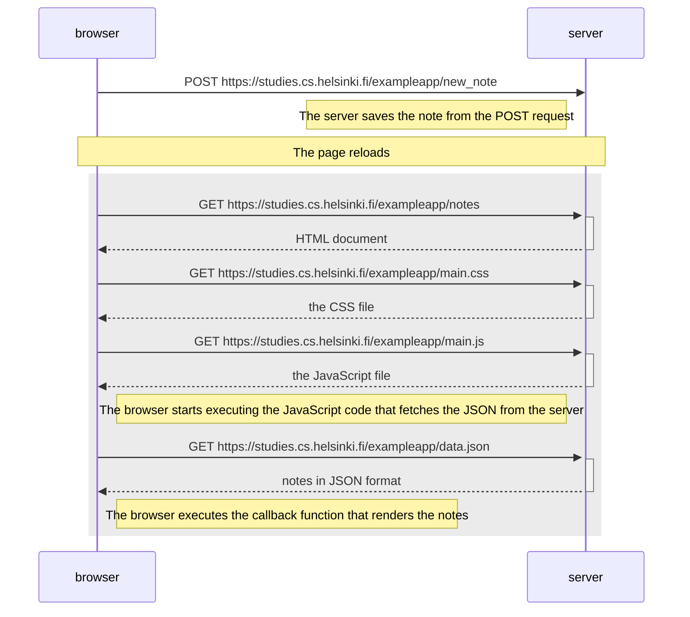

```mermaid
sequenceDiagram

participant browser
participant server

browser->>server: POST https://studies.cs.helsinki.fi/exampleapp/new_note
activate server

Note left of server: The server saves the note from the POST request

Note over browser,server: The page reloads

%% The rest is copied and pasted from the course, as the page reload is identical
%% https://fullstackopen.com/en/part0/fundamentals_of_web_apps#loading-a-page-containing-java-script-review
rect rgb(235, 235, 235)
    browser->>server: GET https://studies.cs.helsinki.fi/exampleapp/notes
    activate server
    server-->>browser: HTML document
    deactivate server

    browser->>server: GET https://studies.cs.helsinki.fi/exampleapp/main.css
    activate server
    server-->>browser: the CSS file
    deactivate server

    browser->>server: GET https://studies.cs.helsinki.fi/exampleapp/main.js
    activate server
    server-->>browser: the JavaScript file
    deactivate server

    Note right of browser: The browser starts executing the JavaScript code that fetches the JSON from the server

    browser->>server: GET https://studies.cs.helsinki.fi/exampleapp/data.json
    activate server
    server-->>browser: notes in JSON format
    deactivate server

    Note right of browser: The browser executes the callback function that renders the notes
end
```
