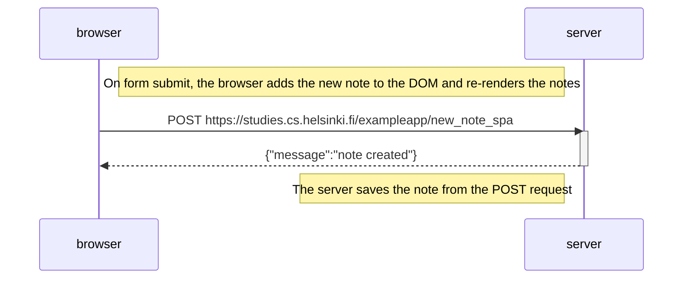

```mermaid
sequenceDiagram

participant browser
participant server

Note right of browser: On form submit, the browser adds the new note to the DOM and re-renders the notes

browser->>server: POST https://studies.cs.helsinki.fi/exampleapp/new_note_spa
activate server
server-->>browser: {"message":"note created"}
deactivate server

Note left of server: The server saves the note from the POST request
```
